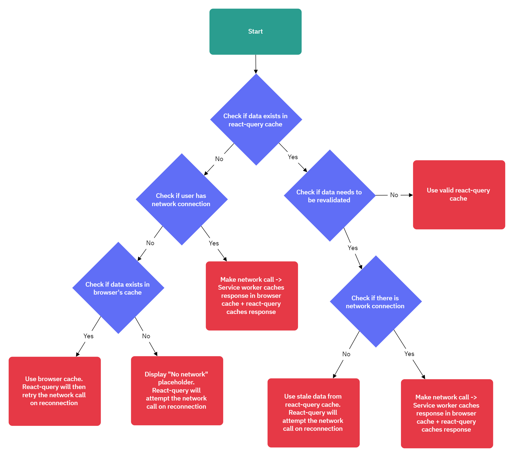

# React TypeScript Vite Template

---

- [React TypeScript Vite Template](#react-typescript-vite-template)
  - [UI:](#ui)
    - [Updating Themes \& Colors](#updating-themes--colors)
    - [UI Component Examples:](#ui-component-examples)
    - [UI Packages:](#ui-packages)
  - [PWA Setup:](#pwa-setup)
    - [Updating App Name \& Details:](#updating-app-name--details)
    - [Updating App Logo:](#updating-app-logo)
  - [Service Worker \& Caching Updating Config Options:](#service-worker--caching-updating-config-options)
    - [runtimeCaching current config info:](#runtimecaching-current-config-info)
      - [Caching Architecture:](#caching-architecture)
    - [Setup:](#setup)
      - [For localhost:](#for-localhost)
      - [For deployed dev/prod:](#for-deployed-devprod)
    - [Prompt Updating vs. Auto-Updating Settings:](#prompt-updating-vs-auto-updating-settings)
      - [a. How to Setup Auto Update Cache / Service Worker:](#a-how-to-setup-auto-update-cache--service-worker)
      - [b. How to Setup Update Cache / Service Worker Prompt:](#b-how-to-setup-update-cache--service-worker-prompt)
  - [Set Up Dev \& Prod Env With Firebase Hosting:](#set-up-dev--prod-env-with-firebase-hosting)
    - [Initial Setup:](#initial-setup)
    - [Setting up Dev \& Prod Firebase Projects:](#setting-up-dev--prod-firebase-projects)
      - [For each Firebase Project (dev/prod), Do the Following:](#for-each-firebase-project-devprod-do-the-following)
  - [CI/CD Workflow Setup With GitHub Actions:](#cicd-workflow-setup-with-github-actions)
    - [Initial Setup:](#initial-setup-1)
    - [Firebase Service Account Key Setup:](#firebase-service-account-key-setup)
      - [For each Firebase Project (dev/prod), Do the Following:](#for-each-firebase-project-devprod-do-the-following-1)
    - [Post GitHub Actions Setup:](#post-github-actions-setup)
  - [Firebase Cloud Messaging \& Microservice Setup:](#firebase-cloud-messaging--microservice-setup)

---

## UI:

### Updating Themes & Colors

1. Go to _root/src/global/styles/colors.tsx_
2. Update the color values in the `Color` class

### UI Component Examples:

-  Go to _root/src/global/components/examples/ExampleUIComponents.tsx_ to view a list of example functional components that use the UI components
-  To view what the example component looks like, simply import and render it into _App.tsx_
-  **_NOTE_**: _Some animations for these components may not work if animated effects are disabled in Windows 11 settings_

### UI Packages:

-  Icons Library = styled-icons

---

## PWA Setup:

### Updating App Name & Details:

1. Go to _root/index.html_ -> update the text within the `title` tag to the new app name
2. Go to _root/vite.config.ts_ -> update the `manifest` object with the new app details

### Updating App Logo:

1. Create a 192x192 png image of the logo and save it as `logo-192x192`
2. Go to _root/public/icons_ -> replace the `logo-192x192.png` file with the file of the new logo
3. Repeat steps 1 & 2 for a 512x512 sized png image of the logo
4. Go to _root/public/icons_ -> copy the `logo-192x192.png` file to _root/src/global/components/lib/splashScreen_

---

## Service Worker & Caching Updating Config Options:

_service worker and caching config options can be found in vite.config.ts_

### runtimeCaching current config info:

-  `urlPattern: /^https?.*/` -> all http requests will be cached
-  `handler: 'NetworkFirst'` -> The service worker will first try to fetch the request from the network, if it fails, it will then try to fetch it from the cache. Other handler options include:
   1. `NetworkOnly` -> The service worker will only try to fetch the request from the network
   2. `CacheFirst` -> The service worker will first try to fetch the request from the cache, if it fails, it will then try to fetch it from the network
   3. `CacheOnly` -> The service worker will only try to fetch the request from the cache
   4. `StaleWhileRevalidate` -> The service worker will first try to fetch the request from the cache, if it fails, it will then try to fetch it from the network. If the network request is successful, the service worker will update the cache with the new response
-  `method: GET` -> by default, service workers only cache GET requests. This is added just to make it more verbose
-  `maxEntries: 500` -> the maximum number of entries the cache can hold
-  `maxAgeSeconds: twoHoursInSeconds` -> cache entries are set to expire after 2 hours
-  `cacheableResponses: [ { statuses: [0, 200] } ]` -> only cache responses with a status code of 0 or 200 to avoid caching errors
-  `matchOptions: { ignoreSearch: false }` -> Do not ignore the query string when matching a request to a cache entry _(microservices are passed through as a query string so that the cache can differentiate between different requests sent to the same api-gateway url)_

#### Caching Architecture:
***Process Flow Diagram (Service-Worker & React-Query Caching Integration):***


### Setup:

#### For localhost:

-  **_When the app is running on localhost, static assets are no pre-cached, so in order to test offline capabilities locally:_**
   1. Go to _vite.config.ts_
   2. Change the `urlPattern` to `/^https?.*/`

#### For deployed dev/prod:

-  **_When the app is deployed, static assets are all pre-cached, so we only need to cache the api-gateway fetch requests in the runtimeCaching to test offlin capabilities. To do this:_**
   1. Go to _vite.config.ts_
   2. Change the `urlPattern` to a regEx that matches the url for your _deployed_ dev/prod _api-gateways_

### Prompt Updating vs. Auto-Updating Settings:

#### a. How to Setup Auto Update Cache / Service Worker:

1. Delete the _dev-dist_ folder in the root directory (if it exists)
2. Make the following changes to the vite.config.ts file:

   ```javascript
   registerType: 'autoUpdate',
   workbox: {
   cleanupOutdatedCaches: true,
   skipWaiting: true,
   },
   ```

3. Go to _root/src/main.tsx_ -> comment out / delete the `UpdateAppModal` component (if it is present)
4. Delete the browser history and cache for the domains `localhost` and `deployed-website`

#### b. How to Setup Update Cache / Service Worker Prompt:

1. Delete the _dev-dist_ folder in the root directory (if it exists)
2. Make the following changes to the vite.config.ts file:

   ```javascript
   registerType: 'prompt',
   workbox: {
   cleanupOutdatedCaches: true,
   // delete skipWaiting
   },
   ```

3. Go to _root/src/main.tsx_ -> import and add the `<UpdateAppModal/>` component just above the `App` component in the return statement
4. Delete the browser history and cache for the domains `localhost` and `the deployed website`

---

## Set Up Dev & Prod Env With Firebase Hosting:

### Initial Setup:

2. Install Firebase CLI globally (_if not already installed_)
3. Install Firebase in the project directory by running `npm install firebase`
4. In terminal, run `firebase login` and login to your firebase account
5. In terminal, run `firebase init` and choose the following options:
   -  _if it states that the project has already been initialised, then delete the firebase.json file and run `firebase init` again_
   -  Service: `Hosting (without GitHub Actions)`
   -  Project: `don't setup a default project`
   -  Public Directory: `dist`
   -  Single Page App: `n`
   -  Automatic Builds with GitHub Actions: `n`
6. Create the following files in the _root_ directory:
   1. .env.devdeployed
   2. .env.devlocal
   3. .env.proddeployed
   4. .env.prodlocal
7. Add the following to each of these files:

```javascript
VITE_APIKEY=
VITE_AUTHDOMAIN=
VITE_PROJECTID=
VITE_STORAGEBUCKET=
VITE_MESSAGINGSENDERID=
VITE_APPID=
VITE_MEASUREMENTID=
```

8. Add the following scripts to package.json (_if not already added_):
   -  `"start-prod-to-deployed": "vite --mode proddeployed --host"`
   -  `"start-dev-to-deployed": "vite --mode devdeployed --host"`
   -  `"start-prod-to-local": "vite --mode prodlocal --host"`
   -  `"start-dev-to-local": "vite --mode devlocal --host"`
   -  `"build-dev": "tsc && vite build --mode devdeployed"`
   -  `build-prod": "tsc && vite build --mode proddeployed`

### Setting up Dev & Prod Firebase Projects:

#### For each Firebase Project (dev/prod), Do the Following:

1. Create the firebase project
2. Enable Google Analytics
3. Enable the option to add a Web App (if not done already & Don't Check Firebase Hosting)
4. Change the Firebase plan to Blaze (Pay as you go)
5. In the Firebase Console, go to Project Settings -> General -> Copy the Project ID
6. In the React App in terminal, Run `firebase use --add [project-id]`
7. Go to _package.json_ and add/update the following script (_update it with the correct project id if it already exists_)
   -  `"deploy-[dev/prod]": "npm run build-[dev/prod] && firebase deploy --only hosting --project [project-id]"`
8. Open the _.env_ files that correspond to the firebase project (either the `.env.dev...` files or the `.env.prod...` files)
9. Go back to the Firebase Console -> Project Settings -> General -> Scroll down to the Firebase Config
10.   Copy the values from the Firebase Config and paste them into their corresponding variable names in the .env files (without the speech marks)
11.   For setting up Firebase Cloud Messaging:
      1. Go back to Firebase Console -> Project Settings -> Cloud Messaging -> Press _Generate key pair_
      2. Copy the _Key pair_ value and paste it into the .env files that correspond to the firebase project (either the `.env.dev...` files or the `.env.prod...` files) as:
         -  `VITE_VAPID_KEY` = `[copied-key-pair-val]`
12.   Run `npm run deploy-[dev/prod]` to deploy the app to firebase hosting and test it out to ensure it's working.

---

## CI/CD Workflow Setup With GitHub Actions:

### Initial Setup:

1. In the React proj, push any changes in the current branch -> then create a new branch from `prod` called `dev`
2. Go to the GitHub Repo -> Settings -> Secrets -> Actions -> Add the following secrets:
   -  `ENV_DEVDEPLOYED` -> copy the content from `.env.devdeployed` in my react proj root directory to it
   -  `ENV_PRODDEPLOYED` -> copy the content from `.env.proddeployed` in my react proj root directory to it

### Firebase Service Account Key Setup:

#### For each Firebase Project (dev/prod), Do the Following:

1. In terminal run `firebase init hosting:github --project [project-id]`
2. Answer the questions in the following way:
   -  _Are you ready to proceed_ -> `y`
   -  _For which GitHub repository would you like to set up a GitHub workflow_ -> `[github-username]/[github-repo-name]`
   -  _Setup a workflow ..._ -> `n`
   -  _Setup automatic deployment ..._ -> `n`
   -  Press CTRL + C to exit the Firebase CLI
3. Go to the GitHub Repo -> Settings -> Secrets -> Actions -> copy the name of the secret that Firebase Cli generated
4. In the React Proj go to _root/.github/workflows/ci-cd_
5. For the value of the env variable `[DEV/PROD]_SA_KEY` -> set it to `{{ secrets.[THE_NAME_OF_THE_SECRET_FIREBASE_CLI_GENERATED_IN_THIS_REPO] }}`
6. In the React Proj go to _root/.github/workflows_ -> delete any files that Firebase Cli generated (should only be left with ci-cd.yml)

### Post GitHub Actions Setup:

1. Merge the `dev` and `prod` branches
2. Test to see if you can still deploy locally to dev by running `npm run deploy-dev`
3. Test to see if you can still deploy locally to prod by running `npm run deploy-prod`
4. Test to see if GitHub Actions deploys to prod successfully by pushing a change to the `prod` branch
5. Test to see if GitHub Actions deploys to dev successfully by pushing a change to the `dev` branch

## Firebase Cloud Messaging & Microservice Setup:
1. Set up a microservice that will handle everything to do with Firebase Cloud Messaging using the [_Microservices Template_](https://github.com/SaoodCS/microservice-template)
2. Create a cloud function / subroute which will handle the following:
   1. Retrieves the user's registration token from the client...
   2. //TODO: More research needed on how to handle the rest of the process
3. In this react front-end, go to _root/src/global/firebase/config/config.ts_ -> update the code where the `//TODO` comment is to send the token and other relevant data to the cloud function / subroute
4. //TODO: more research needed on what to do from here... 