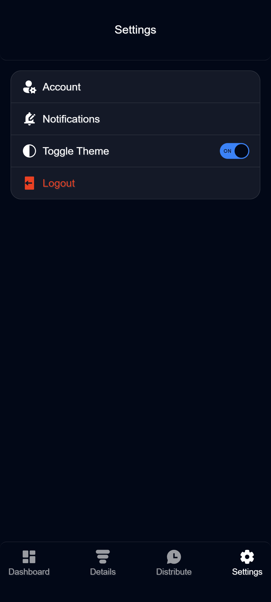
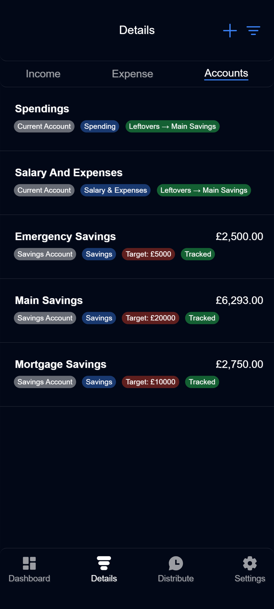
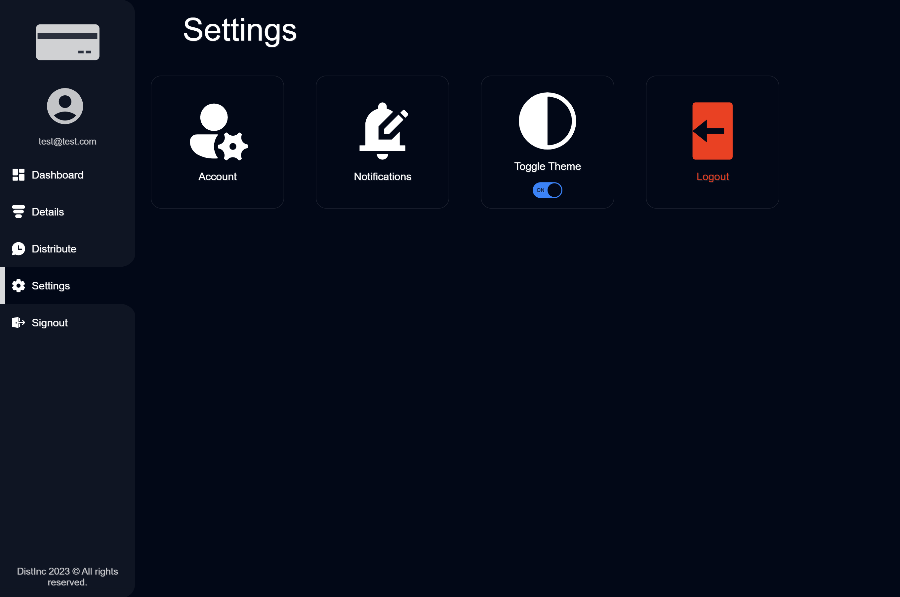
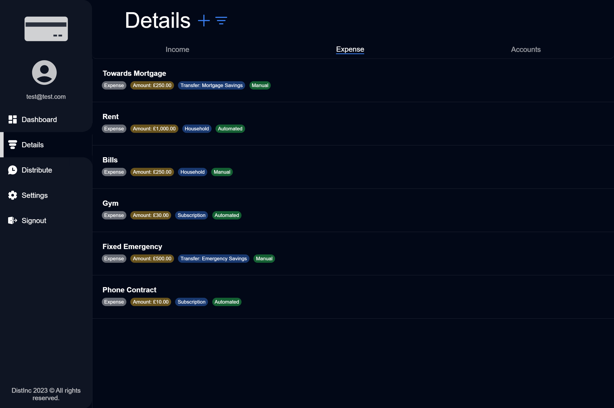

# Distinc Web Application

<a href="www.distinc.co.uk" target="_blank">
   Click Here To Visit The Live Web App 
</a>
 

## About

Distinc serves as a comprehensive financial management tool, enabling users to effortlessly track expenses, monitor balances across multiple bank accounts, set account-specific targets, and calculate monthly income distribution among accounts.

Distinc is a responsive and progressive web application designed to adapt its UI based on the device type. For optimal functionality, install it on your device to access its full range of features.

## Demo Video

<!-- TODO: Add the proper link to this video once I've made it and uploaded it to YouTube -->

## Screenshots

### Mobile Screenshot Examples

| Dashboard | Distribute |
|:---------:|:----------:|
|  |  |
| **Settings** | **Details** |
|  |  |

### Desktop Screenshot Examples

