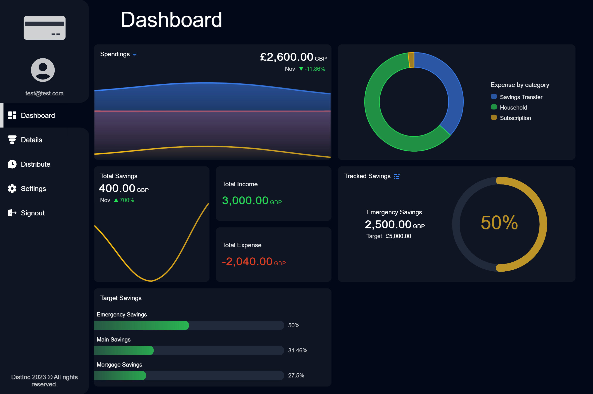
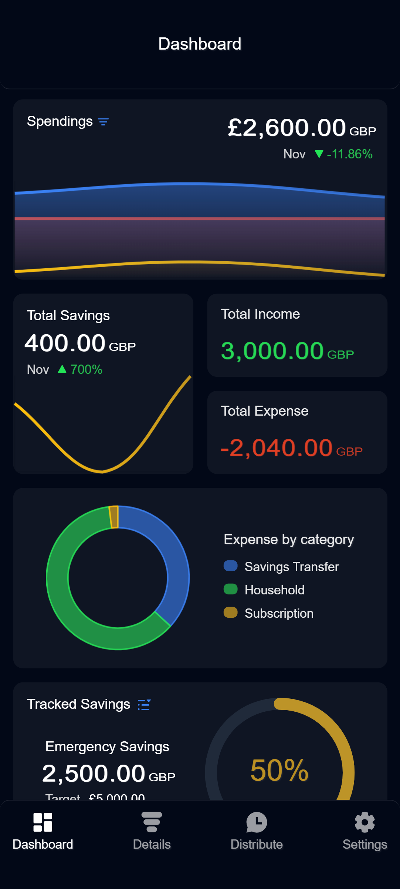
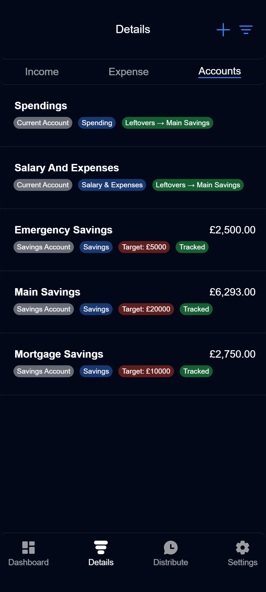
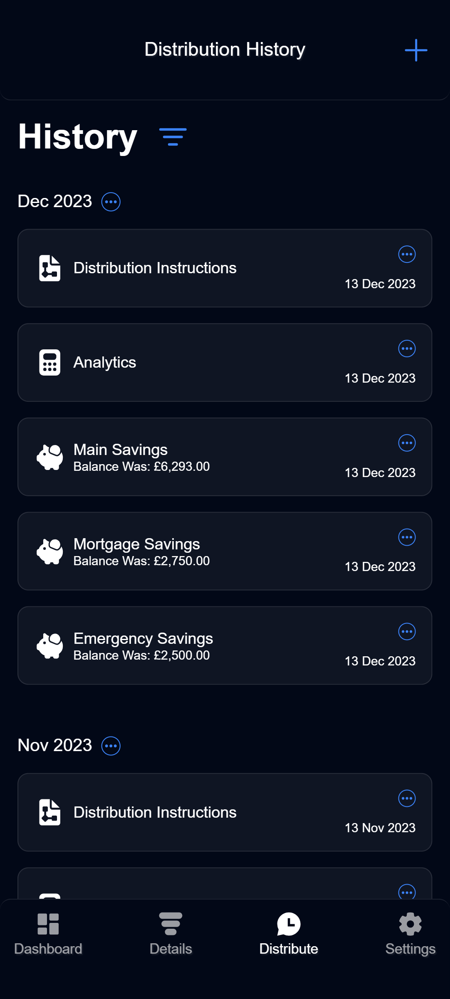
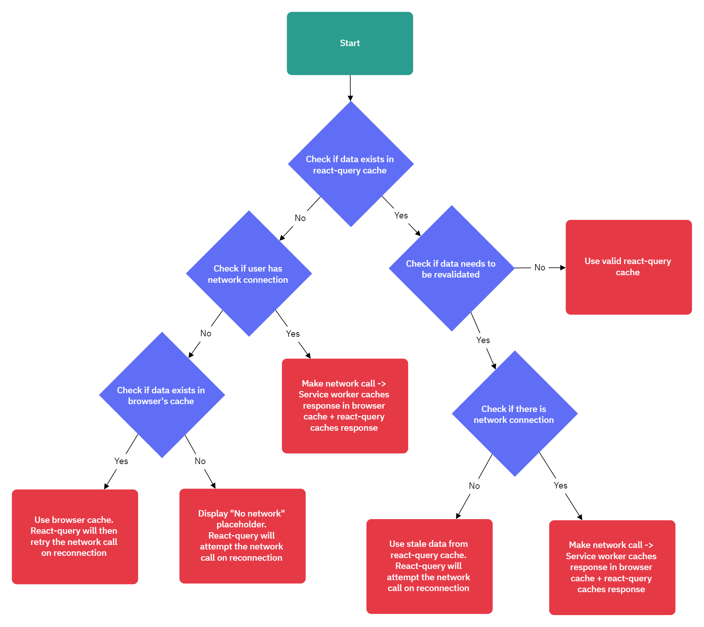

# DistInc

DistInc is a TypeScript React progressive web app for managing personal cash flow, tracking accounts and expenses, and turning monthly income into actionable transfer steps, backed by authenticated Node.js/Firebase microservices.

## Links

| Resource | Link |
|---|---|
| Live app | [distinc.co.uk](https://www.distinc.co.uk) |
| Demo video | [Watch on YouTube](https://youtu.be/xbIUeWg9SuI) |
| API gateway | [DistInc API Gateway](https://github.com/SaoodCS/DistInc-API-Gateway) |
| Data service | [DistInc Data Microservice](https://github.com/SaoodCS/Distinc-Data-Microservice) |
| User service | [DistInc User Microservice](https://github.com/SaoodCS/DistInc-User-Microservice) |
| Notification service | [DistInc Notification Microservice](https://github.com/SaoodCS/Distinc-Notification-Microservice) |

The live app includes a **Login as Test User** option for reviewing the product without creating an account. API endpoints are environment-specific and are not published in this repository.

## Preview

<a href="https://youtu.be/xbIUeWg9SuI">
  
</a>

### Desktop



### Mobile

<table>
  <tr>
    <td></td>
    <td></td>
    <td></td>
  </tr>
</table>

## Tech Stack

| Area | Technology |
|---|---|
| Frontend | React 18, TypeScript 5, Vite 4, React Router 6 |
| Data and state | TanStack Query 4, React Context, local and session storage |
| UI and visualization | styled-components, Sass, Framer Motion, Chart.js |
| PWA | Vite PWA Plugin, Workbox runtime caching, web app manifest |
| Platform services | Firebase Authentication, Cloud Messaging, Hosting |
| Backend integration | Node.js/TypeScript API gateway and Firebase Cloud Functions microservices |
| Quality | Vitest, React Testing Library, strict TypeScript, ESLint, Prettier |
| Delivery | GitHub Actions and Firebase Hosting |

## Key Features

- Tracks income, recurring expenses, and current, credit, and savings accounts.
- Calculates monthly transfer instructions from balances, income, expenses, account cushions, credit balances, and savings rules.
- Presents income, spending, savings progress, and category data through dashboard charts.
- Stores distribution history, analytics, and tracked savings balances for later review.
- Protects application routes with Firebase Authentication and adds Firebase ID tokens to secured gateway requests.
- Adapts navigation and layouts for portable and desktop devices, with dark and light themes.
- Supports install prompts, pull-to-refresh, cached reads, reconnect refetching, and updateable service workers.
- Schedules reminders and handles foreground/background notifications where Firebase Cloud Messaging is supported.

## Getting Started

### Prerequisites

- Node.js `20.12.2`
- npm
- Windows PowerShell for the repository's environment and HTTPS setup scripts
- Firebase client configuration and deployed or locally running DistInc API endpoints

```bash
git clone https://github.com/SaoodCS/DistInc-PWA-React-TypeScript-Front-End.git
cd DistInc-PWA-React-TypeScript-Front-End
npm install
```

Create one of the environment files expected by the start scripts, such as `.env.proddeployed`. Environment files are gitignored and no `.env.example` is currently included.

| Purpose | Variables |
|---|---|
| Firebase client | `VITE_APIKEY`, `VITE_AUTHDOMAIN`, `VITE_PROJECTID`, `VITE_STORAGEBUCKET`, `VITE_MESSAGINGSENDERID`, `VITE_APPID`, `VITE_MEASUREMENTID` |
| Push notifications | `VITE_VAPID_KEY` |
| API gateway | `VITE_ENDPOINT_GATEWAY_GET`, `VITE_ENDPOINT_GATEWAY_POST` |
| Demo login | `VITE_TEST_USER_EMAIL`, `VITE_TEST_USER_PASSWORD` |
| Runtime target | `VITE_RUNNING` |

For the provided Windows workflow:

```bash
npm run setup-os-env
npm run start-prod-to-deployed
```

`setup-os-env` provisions the configured Node version and Firebase CLI. The start command also runs the local certificate script, generates the Firebase messaging service worker from the selected environment, and starts Vite over HTTPS. A shell or editor restart may be required after first-time tool installation.

To use locally hosted backend services instead, configure `.env.prodlocal` or `.env.devlocal` and run the matching `start-*-to-local` script.

## Available Scripts

| Command | Description |
|---|---|
| `npm run dev` | Starts the Vite development server using the default mode |
| `npm run start-prod-to-deployed` | Runs the frontend locally against the deployed production environment |
| `npm run start-dev-to-deployed` | Runs the frontend locally against the deployed development environment |
| `npm run build` | Type-checks and creates a production Vite build |
| `npm run lint-ts` | Runs TypeScript validation and ESLint concurrently |
| `npm run test` | Runs the Vitest test suite |
| `npm run preview` | Serves the generated production build locally |
| `npm run deploy-dev` | Builds and deploys the development site to Firebase Hosting |
| `npm run deploy-prod` | Builds and deploys the production site to Firebase Hosting |

## Architecture

The frontend is organized by route-level product areas, supported by reusable global UI, context providers, hooks, and a centralized Firebase/API integration layer.

```text
src/
├── pages/                 # Authentication, dashboard, details, distribution, settings
├── routes/                # Public, authenticated, admin, and fallback routes
├── global/components/     # App layout and reusable UI components
├── global/context/        # Auth, device, theme, notifications, and UI state
├── global/firebase/       # Firebase config, gateway client, service registry, FCM worker
├── global/hooks/          # Forms, mutations, storage, URL state, and scroll state
└── global/helpers/        # Typed domain and data transformation utilities
```

Data flows from page-specific query and mutation modules through a shared gateway client. The client identifies the requested service in a header and attaches a Firebase ID token for protected operations. The separate API gateway then routes requests to user, data, or notification Cloud Functions.

```text
React UI -> TanStack Query -> API client -> API Gateway -> Microservice -> Firebase
```

The income distribution algorithm remains in a focused TypeScript domain module, while persistence and request state stay in query/mutation modules. This keeps calculation behavior separate from transport and rendering concerns.

## PWA and Offline Behavior

- The generated manifest uses a standalone display mode, finance/productivity categories, and `192x192` and `512x512` install icons.
- The application service worker registers immediately and uses an auto-update strategy.
- GET requests use a Workbox `NetworkFirst` runtime cache with up to 500 entries and a one-day expiration.
- TanStack Query uses `offlineFirst` network mode, a 20-minute stale window, and refetches on mount, focus, and reconnection.
- Previously cached reads can remain available without a connection; uncached data and write operations still require network access.
- A separate Firebase messaging service worker handles supported background notifications and app badge updates.



## API Integration

The frontend communicates through two environment-configured gateway endpoints: one for GET requests and one for POST requests. A service registry maps frontend operations to user, financial-data, calculation, and notification capabilities.

Protected requests include the current user's Firebase ID token. The gateway validates request metadata, applies CORS policy, forwards authorization to the target service, and returns normalized errors to the UI. Firestore persistence and scheduled notification delivery are implemented in the linked backend repositories.

## Testing and Quality

- TypeScript runs in strict mode and the production build starts with `tsc`.
- ESLint includes TypeScript, import, unused-import, Prettier, React, and security rules.
- Vitest runs in `jsdom` with React Testing Library and Jest DOM.
- GitHub Actions runs type/lint checks and tests before Firebase deployment on `dev` and `prod` pushes.
- Production builds remove console statements and debugger calls.

## Deployment

Firebase Hosting serves the production SPA and rewrites unmatched routes to `index.html` for React Router. The GitHub Actions workflow deploys:

- `dev` branch pushes to the DistInc development Firebase project.
- `prod` branch pushes to the production Firebase project and custom domain.

Environment files and Firebase service-account credentials are supplied through GitHub Actions secrets during deployment.

## Engineering Decisions

- Combines TanStack Query's in-memory request state with Workbox's browser-level runtime cache so recent data can survive temporary connectivity loss.
- Uses a single gateway contract and service registry to keep the React client independent of individual microservice URLs.
- Keeps financial distribution calculations client-side and typed, producing transfer instructions, analytics, and savings history before persistence.
- Uses route guards and token-bearing requests so authenticated UI state and protected backend operations follow the same Firebase identity.
- Switches between sidebar and footer navigation based on device context instead of maintaining separate desktop and mobile applications.

## Known Limitations and Roadmap

- Add a sanitized `.env.example` and a cross-platform setup path; current provisioning scripts target Windows.
- Add end-to-end, accessibility, and performance checks to CI.
- Improve offline support for mutations with an explicit queued-write and conflict-resolution strategy.
