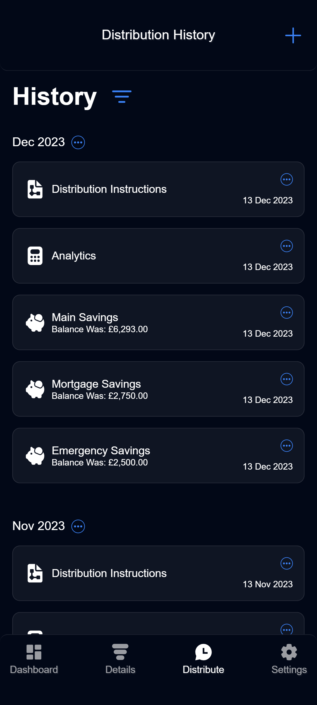
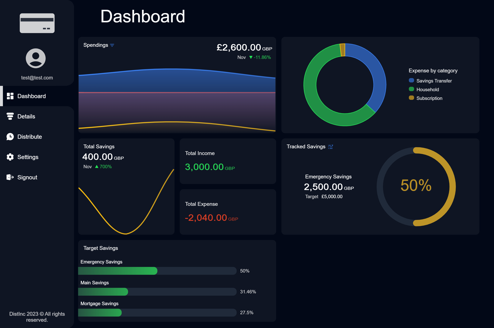

# Distinc Web Application

<a href="www.distinc.co.uk" target="_blank">
   Click Here To Visit The Live Web App 
</a>
 

## Back-End Repositories

<a href="•	https://github.com/SaoodCS/DistInc-API-Gateway?tab=readme-ov-file#distinc-api-gateway" target="_blank">
   Distinc API Gateway
</a>
 
<a href="https://github.com/SaoodCS/Distinc-Data-Microservice?tab=readme-ov-file#distinc-data-microservice" target="_blank">
   Distinc Data Microservice
</a>
 
<a href="https://github.com/SaoodCS/Distinc-User-Microservice?tab=readme-ov-file#distinc-user-microservice" target="_blank">
   Distinc User Microservice
</a>
 
<a href="https://github.com/SaoodCS/Distinc-Notification-Microservice?tab=readme-ov-file#distinc-notification-microservicee" target="_blank">
   Distinc Notification Microservice
</a>
 

## About

Distinc serves as a comprehensive financial management tool, enabling users to effortlessly track expenses, monitor balances across multiple bank accounts, set account-specific targets, and calculate monthly income distribution among accounts.

Distinc is a responsive and progressive web application designed to adapt its UI based on the device type. For optimal functionality, install it on your device to access its full range of features.

## Demo Video

## Screenshots

### Mobile Screenshot Examples

<table border="0">
    <tr>
        <td>
            
        </td>
        <td>
            
        </td>
    </tr>
</table>

### Desktop Screenshot Examples

